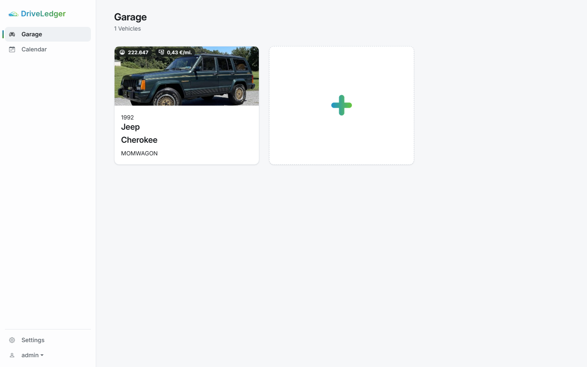
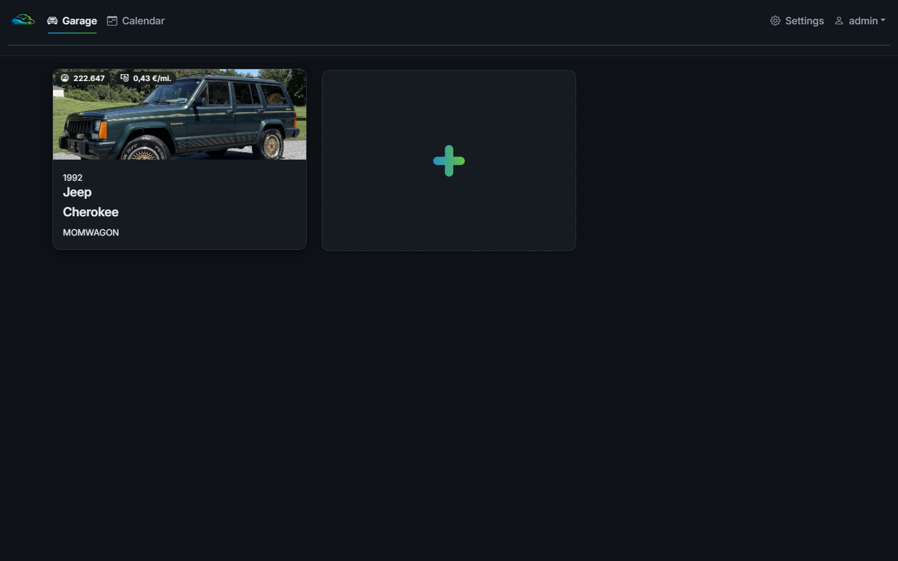
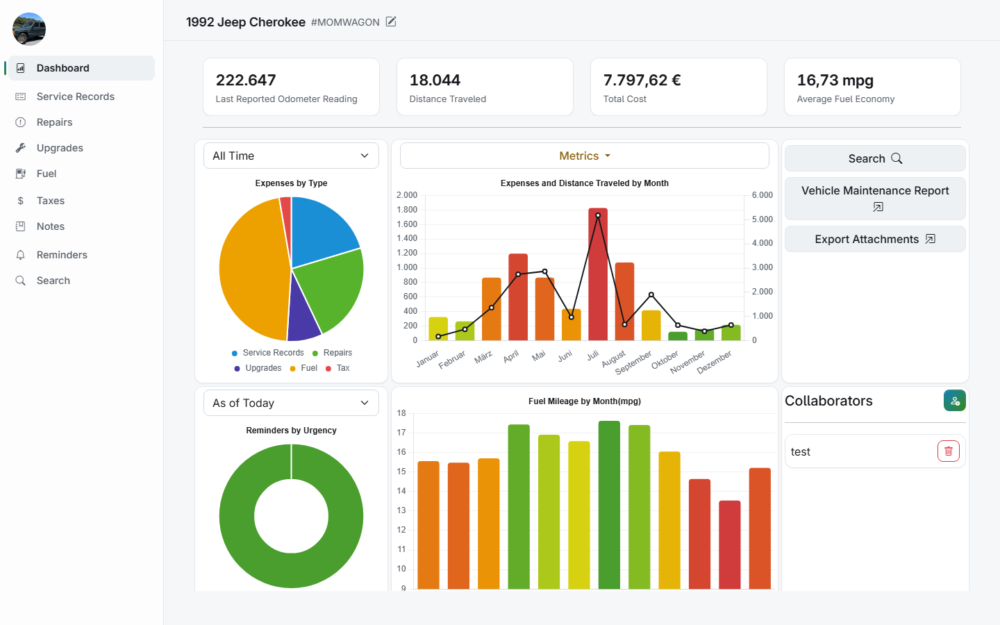
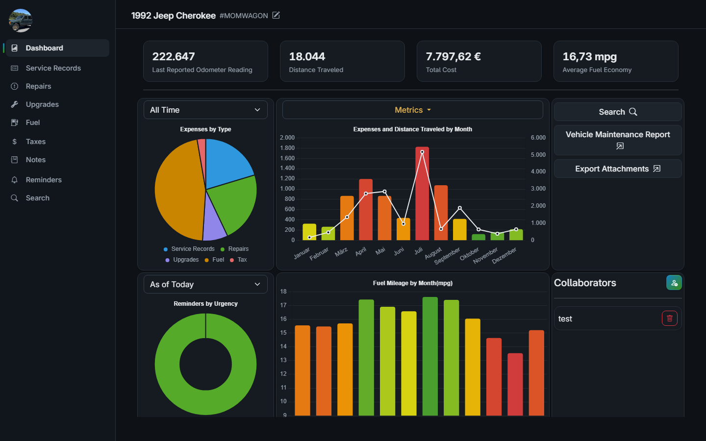
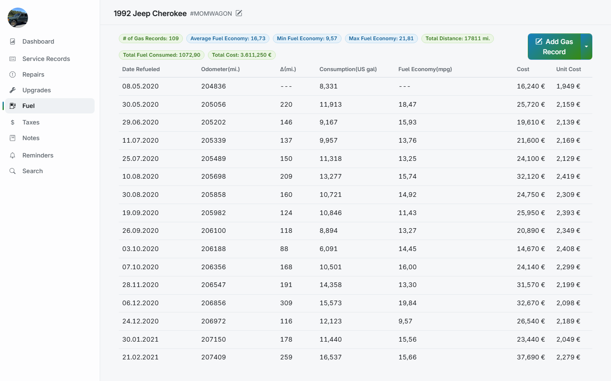
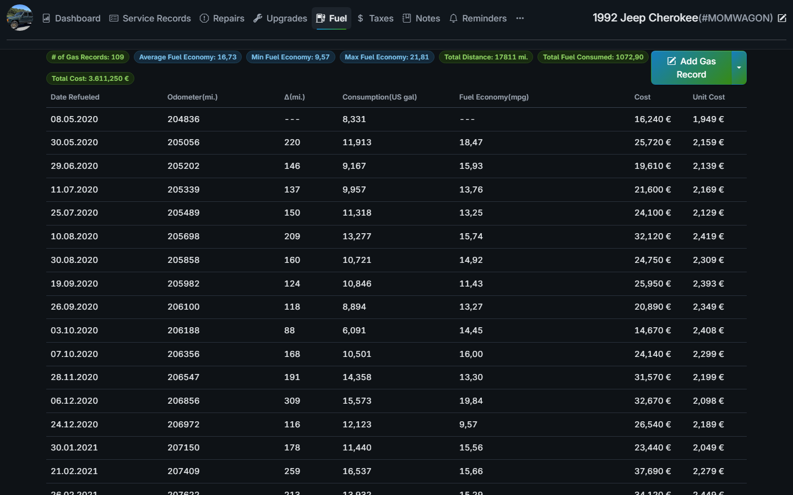

<p align="center">
  
</p>

<h1 align="center">DriveLedger</h1>

<p align="center"><b>DriveLedger — a beautifully redesigned, self-hosted vehicle maintenance & fuel tracker.</b></p>

<p align="center">
  DriveLedger is a visual redesign of <a href="https://github.com/hargata/lubelog">LubeLogger</a>:
  same rock-solid functionality, wrapped in a clean, modern dashboard UI with first-class light and dark modes.
</p>

---

## Screenshots

| Light | Dark |
| --- | --- |
|  |  |
|  |  |
|  |  |

## What's different from LubeLogger?

Purely the looks and the name. DriveLedger keeps LubeLogger's features, data model and API untouched and adds:

- A complete design system built on CSS custom properties: consistent color scales, typography, spacing, radii and shadows across every page.
- Fully maintained **light and dark themes**, including charts, dialogs, date pickers and the mobile UI.
- Self-hosted [Inter](https://github.com/rsms/inter) typography, bundled locally. No CDN calls, works fully offline.
- Accessible, colorblind-checked chart palettes and WCAG AA checked interactive colors.
- Fresh branding: logo, favicons, PWA icons and splash screen.

The database schema, uploaded files and API routes are identical to upstream, so an existing LubeLogger **data volume works as-is** with DriveLedger. Note that the optional environment variables were rebranded from `LUBELOGGER_*` to `DRIVELEDGER_*` (same names otherwise); if you used any of them, rename them once when migrating.

## Features

- Track multiple vehicles in a garage overview with service records, repairs, upgrades, fuel economy, taxes, odometer history, notes, supplies, equipment and inspections.
- Reminders with urgency levels, recurring schedules and a calendar view.
- Fuel economy tracking with configurable units (MPG, l/100km, UK MPG and more).
- Dashboards and reports with charts, cost breakdowns and printable vehicle history.
- Maintenance planner (kanban board), kiosk mode for wall displays, document attachments, custom extra fields.
- Multi-user support with authentication, OpenID Connect, collaborators and households.
- CSV import/export, automated backups, webhooks, translations into many languages.
- LiteDB by default, PostgreSQL optional. Runs anywhere .NET runs, ships as a Docker image.

## Quickstart

### Docker Compose (recommended)

There is no published DriveLedger container image, so the bundled compose file builds it locally:

```bash
git clone https://github.com/KronigDev/DriveLedger.git
cd DriveLedger
docker compose up -d --build
```

The app is then available at http://localhost:8080. Data is persisted in the `data` volume.

For PostgreSQL, adapt `docker-compose.postgresql.yml` the same way (replace the `image:` of the `app` service with `build: .`).

### Plain Docker

```bash
docker build -t driveledger:latest .
docker run -d -p 8080:8080 -v driveledger_data:/App/data driveledger:latest
```

### From source

Requires the [.NET 10 SDK](https://dotnet.microsoft.com/download/dotnet/10.0).

```bash
git clone https://github.com/KronigDev/DriveLedger.git
cd DriveLedger
dotnet run
```

The app starts on http://localhost:5000 and creates its `data/` folder on first run.

## Configuration

DriveLedger is configured like LubeLogger. All settings and reverse-proxy setups are documented in the upstream docs: [docs.lubelogger.com](https://docs.lubelogger.com). The only difference: environment variables use the `DRIVELEDGER_*` prefix instead of `LUBELOGGER_*` (e.g. `DRIVELEDGER_MOTD`, `DRIVELEDGER_LOGO_URL`).

Highlights:

- `POSTGRES_CONNECTION` switches storage from LiteDB to PostgreSQL.
- Authentication is off by default; enable it in Settings or via config.
- `DRIVELEDGER_LOGO_URL` / `DRIVELEDGER_LOGO_SMALL_URL` let you override the bundled logo.

## Attribution

DriveLedger is a fork of [LubeLogger](https://github.com/hargata/lubelog) by [Hargata Softworks](https://github.com/hargata), licensed under the [MIT License](LICENSE). The functionality is unchanged from upstream; this fork contributes a visual redesign and rebranding only.

Huge thanks to Hargata Softworks and the LubeLogger community for building and maintaining such a complete, pragmatic tool. If DriveLedger is useful to you, please consider [supporting the upstream project on Patreon](https://www.patreon.com/LubeLogger).

## License

[MIT](LICENSE) — same license as upstream LubeLogger.
